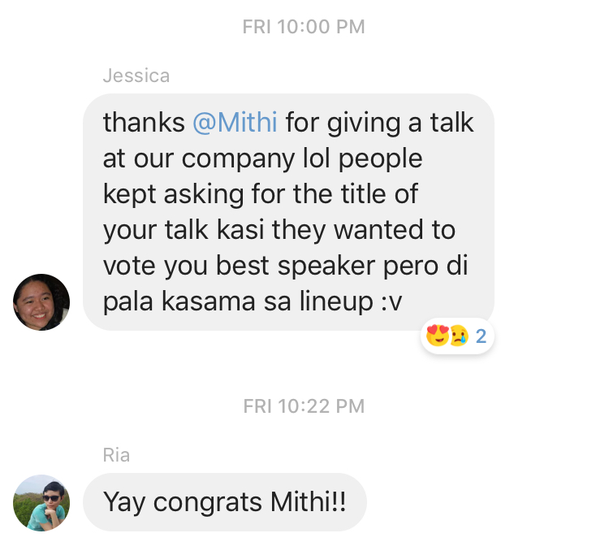
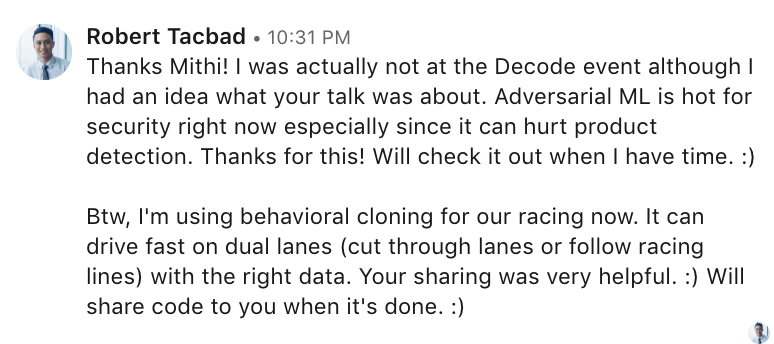

# SDC Talk
- A workshop including talks about a problem-solving philosophy, machine learning intuitions, and behavioral cloning in the context of self-driving / self-racing cars.

# To The Reader
- Open the PDF directory
- Read each PDF 
- Images and other information are properly referenced as far as I know
- If you have any complaints/ issues on Copyrights, please contact me so I can properly reference your work

# Google Slides Access
- [What I’m going to talk about today](https://docs.google.com/presentation/d/1AFEenZrhNXDocOTREZ2Agl_AIHFy1jCZYZZKruV7kvU/edit?usp=sharing)
- [A Problem Solving Philosophy](https://docs.google.com/presentation/d/1W647eSvY3T_BhxgEBA-CZF-LMKNy8HUCbXmIKUiG4WE/edit?usp=sharing)
- [Machine Learning Intuitions: What you should know by heart](https://docs.google.com/presentation/d/1k5E_dpSk3PzaO-HvwMeOy-UIGHSsVCsVcPXoDzdVa1o/edit?usp=sharing)
- [Behavioral cloning](https://docs.google.com/presentation/d/17j62sY2bl-Xn0i7FbsyLoi2B2G10vIRaDAYhW-z89IE/edit?usp=sharing)

# Related
- [Little Miss Trendy](https://github.com/mithi/little-miss-trendy/)
- [Simulated Rover using traditional OpenCV techniques](https://github.com/mithi/some-udacity-projects/tree/some-udacity-projects/rover)

# ADDITIONAL NOTES:
- Note: For PID controllers a lowpass filter is usually necessary to filter out noisy sensor data for the derivative part
- [Control Guru: Using Signal Filters](https://controlguru.com/using-signal-filters-in-our-pid-loop/)
- [Berkeley: Lowpass filter for Derivative Control](https://ptolemy.berkeley.edu/projects/chess/tbd/wiki/C-code/LowPassFilterForDerivativeControl)

